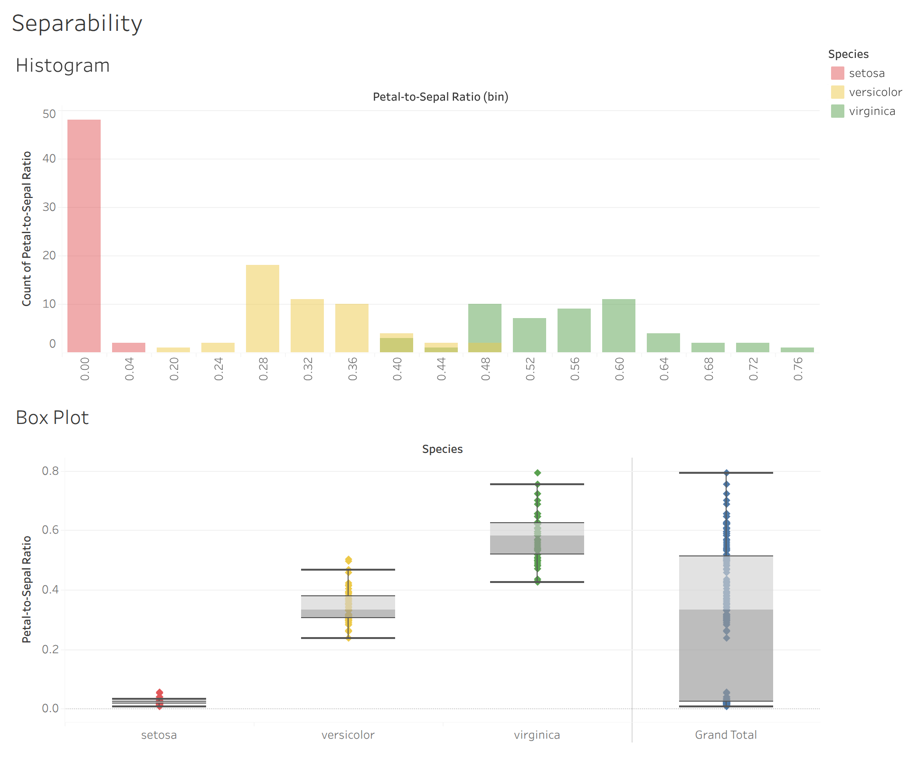

# `ds_projects/01_iris`

**An end-to-end classification project with the classic iris dataset.
Written by Manuel A. Buen-Abad.**

📄 Description
-----------------------------------------

The original dataset consists of 150 measurement records of three species of iris flowers: iris setosa, iris versicolor, and iris virginica. These are measurements of the length and width of the petals and sepals of the flowers. This is a balanced dataset: there are 50 records for each species.

In this end-to-end project, I

1. collect, transform, and deploy the data in various ways (ETL);
2. engage in thorough exploratory analysis (EDA) through statistics and data visualization reports;
3. use domain knowledge and unsupervised learning for feature engineering;
4. employ rigorous feature selection methods;
5. construct automated pipelines that, in addition to performing the steps listed above:

	a. employ various state-of-the-art AI/ML/DL algorithms,
	
	b. cross validate them,
	
	c. tunes their hyperparameters, and
	
	d. produces statistical and explanatory ML reports (including metrics such as the F1 score, plotting SHAP values, etc.); and
	
6. evaluate the models, select the best, and save it locally.

📊 Dashboard
-----------------------------------------

**Tableau Public Dashboard**: _"The Iris Dataset"_.

💡 [Live Demo](./demo/index.html)

🔗 [Public Link](https://public.tableau.com/views/TheIrisDataset_17540796746250/Separability?:language=en-US&:sid=&:redirect=auth&:display_count=n&:origin=viz_share_link)

❓ Requirements
-----------------------------------------

1. python
2. matplotlib
3. seaborn
4. numpy
5. pandas
6. scikit-learn
7. xgboost
8. shap
9. graphviz
10. dill
