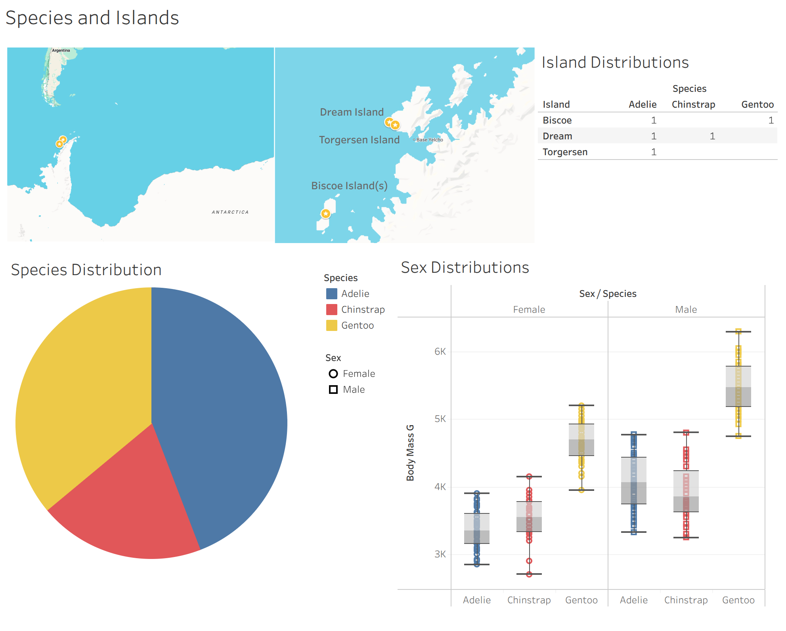

# `ds_projects/02_penguins`

**An end-to-end classification project with the penguins dataset.
Written by Manuel A. Buen-Abad.**

📄 Description
-----------------------------------------

The dataset consists of 343 records of three species of antarctic penguins: adelie (_Pygoscelis adeliae_), chinstrap (_Pygoscelis antarcticus_), and gentoo (_Pygoscelis papua_). These records include the following features: the island they inhabit, their bill, flipper, and weight measurements, and their sex. This is an unbalanced dataset: there are different number of entries for each species.

In this end-to-end project, I

1. collect, transform (including cleaning), and deploy the data in various ways (ETL);
2. engage in thorough exploratory analysis (EDA) through statistics and data visualization reports;
3. use domain knowledge and unsupervised learning for feature engineering;
4. employ rigorous feature selection methods;
5. construct automated pipelines that, in addition to performing the steps listed above:

	a. employ various state-of-the-art AI/ML/DL algorithms,
	
	b. cross validate them,
	
	c. tunes their hyperparameters, and
	
	d. produces statistical and explanatory ML reports (including metrics such as the F1 score, plotting SHAP values, etc.);
	
6. evaluate the models, select the best, and save it locally.

📒 Notebook
-----------------------------------------
**Jupyter Notebook**: `01_iris.ipynb`

📓 [Up-to-date Notebook](./notebooks/02_penguins.ipynb)

📌 [Snapshot](./notebooks/index.html)

📊 Dashboard
-----------------------------------------

**Tableau Public Dashboard**: _"The Penguins Dataset"_.

💡 [Live Demo](./demo/index.html)

🔗 [Public Link](https://public.tableau.com/views/ThePenguinsDataset/PenguinMeasurements?:language=en-US&:sid=&:redirect=auth&:display_count=n&:origin=viz_share_link)

❓ Requirements
-----------------------------------------

1. python
2. matplotlib
3. seaborn
4. numpy
5. pandas
6. scikit-learn
7. xgboost
8. shap
9. graphviz
10. dill
