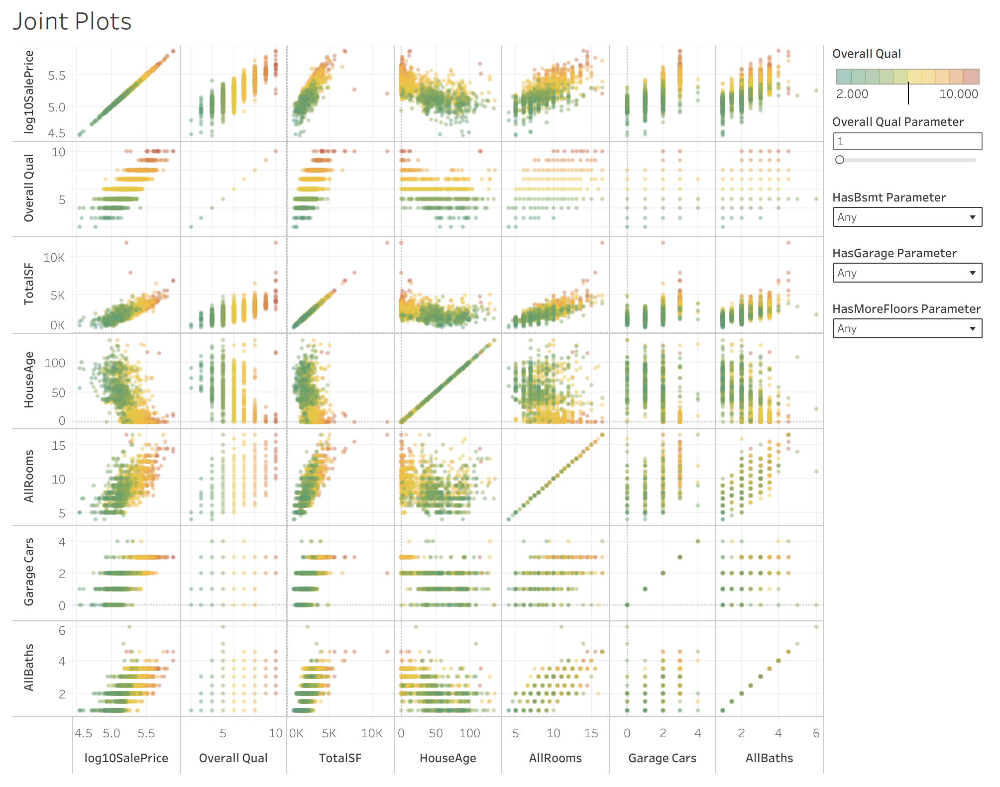

# `ds_projects/03_homes`

**An end-to-end regression project with the Ames IA homes dataset.
Written by Manuel A. Buen-Abad.**

📄 Description
-----------------------------------------

The dataset consists of 1,460 training and 1,460 test records of 80 features of various homes sold in the city of Ames, IA; the training dataset also includes the prices at which each home was sold.

In this end-to-end project, I

1. collect, transform, and deploy the data in various ways (ETL), including a thorough, automated cleaning of the same;
2. engage in painstaking exploratory analysis (EDA) through statistics and data visualization reports;
3. use domain knowledge and both supervised and unsupervised learning for feature engineering;
4. employ rigorous feature selection methods;
5. construct automated pipelines that, in addition to performing the steps listed above:

	a. employ various state-of-the-art AI/ML/DL algorithms (including stacked and boosted ensamble models),
	
	b. cross validate them,
	
	c. tunes their hyperparameters, and
	
	d. produces statistical and explanatory ML reports (including metrics such as the RMSE score, plotting SHAP values, etc.); and
	
6. evaluate the models, select the best, and save it locally.

Because this project is so long and complex, I have broken down the notebook into two parts: `03_homes_01.ipynb`, and `03_homes_02.ipynb`.

📒 Notebook
-----------------------------------------
**Jupyter Notebook**: `03_homes.ipynb`

📓 [Up-to-date Notebook](./notebooks/03_homes.ipynb)

📌 [Snapshot](./notebooks/index.html)

📊 Dashboard
-----------------------------------------

**Tableau Public Dashboard**: _"The Ames, IA Housing Dataset"_.

💡 [Live Demo](./demo/index.html)

🔗 [Public Link](https://public.tableau.com/views/TheAmesIAHousingDataset/JointPlots?:language=en-US&:sid=&:redirect=auth&:display_count=n&:origin=viz_share_link)

❓ Requirements
-----------------------------------------

1. python
2. matplotlib
3. seaborn
4. numpy
5. pandas
6. scikit-learn
7. xgboost
8. catboost
9. shap
10. graphviz
11. dill
