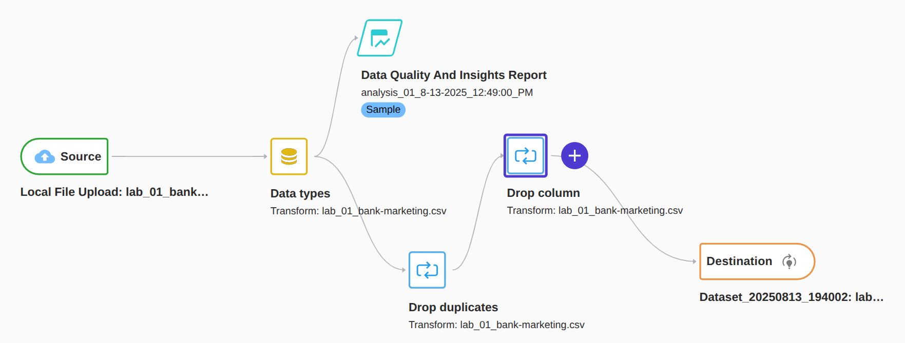
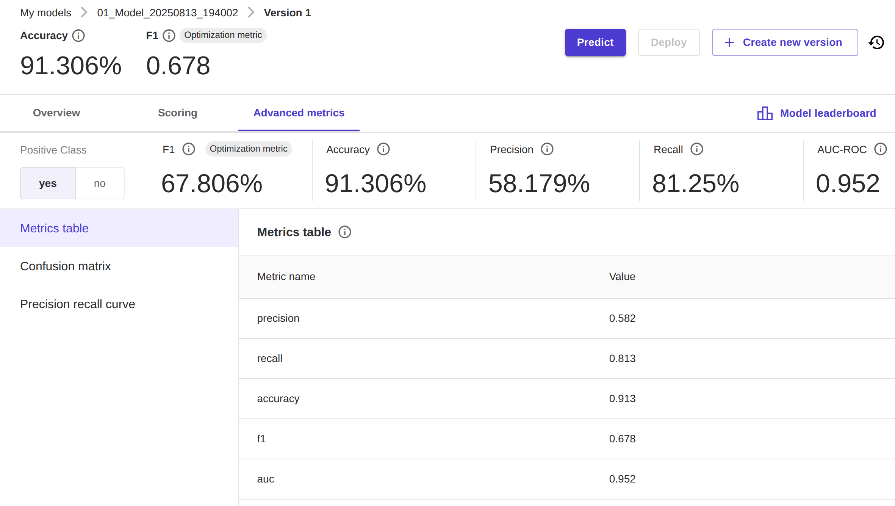
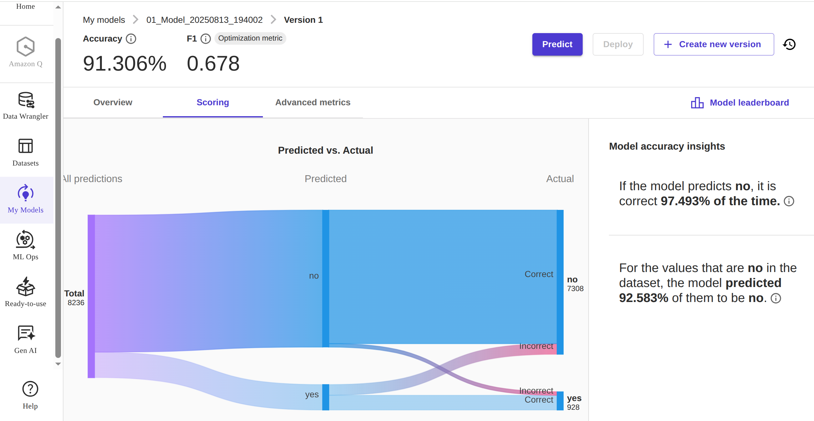
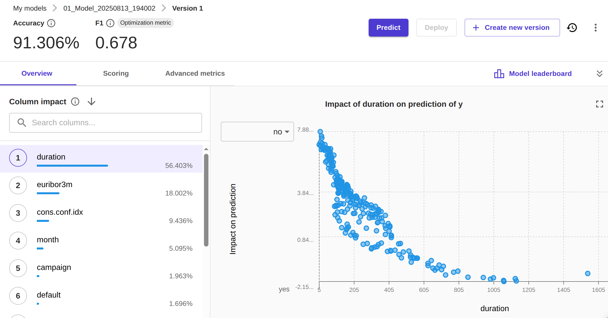
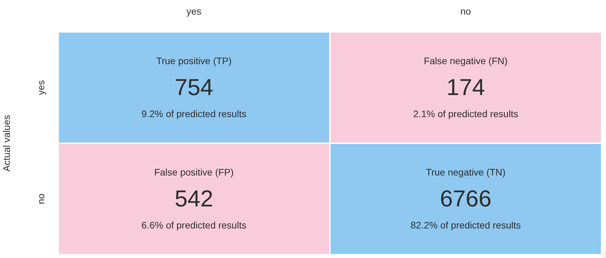
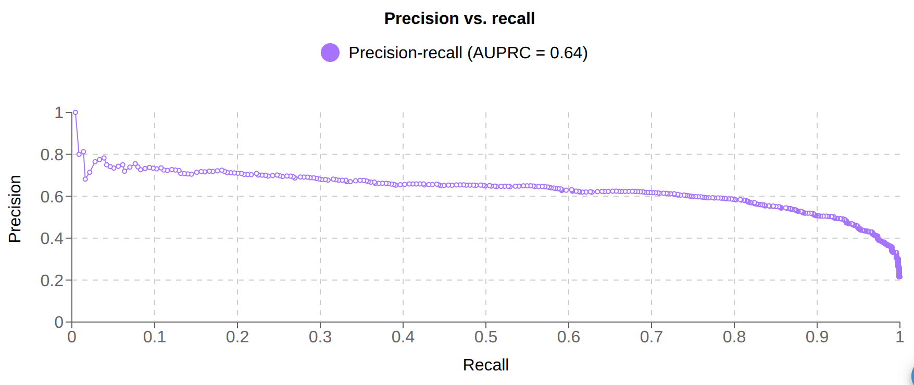

# `ds_projects/04_cds`

**An end-to-end regression project with the bank marketing dataset.
Written by Manuel A. Buen-Abad.**

📄 Description
-----------------------------------------

The dataset consists of 41,188 records of 20 features of bank clients. The target is to predict whether the client bought a certificate of deposit (CD) or not.

This project was made via Amazon SageMaker AI, one of the Amazon Web Services (AWS) products. In particular, I used Canvas and Autopilot in order to quickly analyze and preprocess the data, as well as create and train a ML model. The final result is a weighted ensemble model that includes linear regression, extremely randomized trees, NN, and random forest estimators. I achieved an **F1-score** of almost **68%**, and an **accuracy** above **91%**.

📒 Amazon SageMaker AI - Notebook
-----------------------------------------
**Jupyter Notebook**: `04_cds.ipynb`

📓 [Up-to-date "Amazon SageMaker Autopilot Candidate Definition Notebook"](./notebooks/04_cds.ipynb)

📌 [Snapshot](./notebooks/index.html)

📊 Amazon SageMaker AI - Canvas
-----------------------------------------

🔄 **Pipeline**

🔢 **Metrics**

🎯 **Predictions**

🗝️ **Model Insights & Feature Importance**

🧩 **Confusion Matrix**

🎢 **Area Under Precision-Recall Curve (AUPRC)**

❓ Requirements
-----------------------------------------

1. AWS is awesome!
