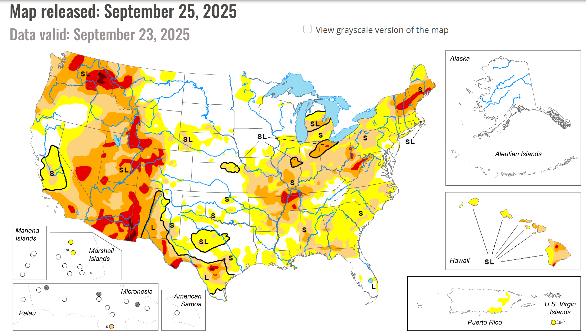
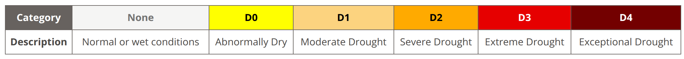

# `ds_projects/05_dsci`

**An end-to-end time-series analysis project with data from the U.S. Drought Monitor (USDM).
Written by Manuel A. Buen-Abad.**

📄 Description
-----------------------------------------

The dataset consists of more than 25 years worth of weekly records (1,343 entries, every Tuesday) of the Drought Severity and Coverage Index (DSCI) of the continental United States, downloaded from [here](https://droughtmonitor.unl.edu/DmData/DataDownload/DSCI.aspx).
The data has a time index (the date of the Tuesday in the week of that record's data), and a single numeric column (the DSCI value).

To compute the DSCI, we make use of the following categories of drought:

For a given area of interest, one then assigns a "coverage" number $C_i$ to each **Di**, which corresponds to the percentage of said area with a drought **_**at least** as severe as Di.
So for example, if $C_2 = 31$ in a given week for the continental US in, then 31% of the continental US has a drought level _of D2 or higher_.

[In the words of the USDM](https://droughtmonitor.unl.edu/About/AbouttheData/DSCI.aspx):

> "The Drought Severity and Coverage Index is an experimental method for converting drought levels from the U.S. Drought Monitor map to a single value for an area. DSCI values are part of the U.S. Drought Monitor data tables. Possible values of the DSCI are from 0 to 500. Zero means that none of the area is abnormally dry or in drought, and 500 means that all of the area is in D4, exceptional drought."

From the $C_i$ we can compute the DSCI.
The data we use computes it according to the traditional (_i.e._, cumulative) method:

$$
\text{DSCI} = \sum\limits_{i=0}^{4} \ C_i \ .
$$

For more details about how to compute the DSCI, see [this fact sheet](https://droughtmonitor.unl.edu/data/docs/DSCI_fact_sheet.pdf) provided by the USDM.
You can also find it locally [here](./demo/DSCI_fact_sheet.pdf).

In this end-to-end project, I

1. collect, transform, and deploy the data in various ways (ETL), including a thorough, automated cleaning of the same;
2. engage in painstaking exploratory analysis (EDA) through statistics and data visualization reports;
3. use domain knowledge and both supervised and unsupervised learning for feature engineering;
4. employ rigorous feature selection methods;
5. construct automated pipelines that, in addition to performing the steps listed above:

	a. employ various state-of-the-art AI/ML/DL algorithms (including stacked and boosted ensamble models),
	
	b. cross validate them,
	
	c. tunes their hyperparameters, and
	
	d. produces statistical and explanatory ML reports (including metrics such as the RMSE score, plotting SHAP values, etc.); and
	
6. evaluate the models, select the best, and save it locally.

📒 Notebook
-----------------------------------------
**Jupyter Notebook**: `05_dsci.ipynb`

📓 [Up-to-date Notebook](./notebooks/05_dsci.ipynb)

📌 [Snapshot](./notebooks/index.html)

❓ Requirements
-----------------------------------------

1. python
2. matplotlib
3. seaborn
4. numpy
5. pandas
6. statsmodels
7. scikit-learn
8. xgboost
9. catboost
10. shap
11. graphviz
12. dill
